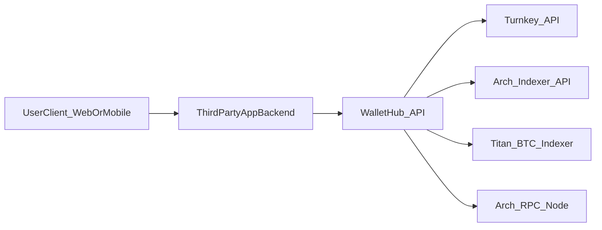
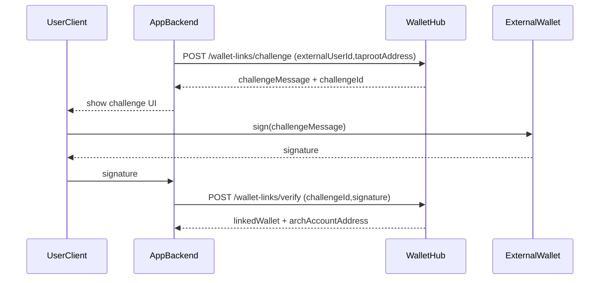

# RFC: Arch Wallet Hub Platform (API + SDK/UI Kit)

## 1. Executive summary
Arch users increasingly hold value on **Arch Network** (ARCH gas + APL tokens) while still using mainstream **Bitcoin wallets** (e.g. Taproot/P2TR wallets). Today those wallets generally do **not** display Arch balances or activity, and they cannot render rich, chain-native transaction previews when asked to sign opaque payloads. This creates a fragmented UX, higher support burden, and inconsistent security posture across the ecosystem.

This RFC proposes **Arch Wallet Hub** as a **multi-tenant, API-first platform** that third-party app developers integrate. Wallet Hub standardizes:

- **Account mapping** (Taproot → Arch account address)
- **Balance/portfolio APIs** (BTC via Titan + ARCH/APL via Arch Indexer)
- **Canonical Arch transaction building** (Arch-owned semantics)
- **Signing orchestration** with a unified interface across:
  - **External wallets** (client-driven signing, e.g. Xverse)
  - **Embedded custody** via **Turnkey** (server-driven signing)
- **Reliability + auditability** (idempotency keys, append-only audit logs)

Wallet Hub does **not** ship a monolithic UI. Instead, we ship:

1) a headless **Wallet Hub API** (OpenAPI-first)\n
2) a **TypeScript SDK** and optional **React UI kit** that apps can embed to deliver a wallet-like experience.

## 2. Problem statement

### 2.1 User problems
- **Missing Arch balances in Bitcoin wallets**: users cannot see ARCH/APL holdings in common BTC wallets because the data lives on Arch and requires indexer + address mapping.
- **Opaque signing**: when a wallet is asked to sign an opaque hash/byte payload, the wallet UI cannot reliably show “send 10 APL to Alice” the way Phantom/MetaMask can for Solana/EVM native transactions.
- **Fragmented experience**: different dapps show different balance views, transaction previews, and error handling.

### 2.2 Developer problems
- **Re-implementing core logic**: each dapp reimplements Taproot→Arch mapping, indexer integrations, Arch tx building/signing rules, and retry/audit primitives.
- **Inconsistent safety**: lack of canonical construction and audit trails makes it easy to ship subtle signing or replay bugs and hard to debug production issues.

## 3. Goals and non-goals

### 3.1 Goals (v1)
- Provide a **single platform API** for third-party apps to:
  - Resolve Taproot addresses to Arch accounts
  - Fetch consolidated balances:
    - **BTC** via **Titan indexer**
    - **ARCH + APL** via **Arch indexer**
  - Create canonical transaction intents and signing payloads
  - Route signing through either:
    - **External wallet** (client-driven signature submission)
    - **Turnkey** (embedded signing) — as a signing provider
  - Verify signatures and submit transactions to Arch RPC
  - Support safe retries (Idempotency-Key) and audit logging
- Provide a **TypeScript SDK** and **optional React UI kit** so integrations are fast and consistent.

### 3.2 Non-goals (v1)
- Force external wallets (Xverse/Unisat/etc.) to display Arch-aware previews inside their own signing UI.
- Implement a “wallet app” hosted by Arch (i.e., a full consumer wallet product).
- Require third-party apps to adopt a specific frontend framework.

## 4. Key product decision: Turnkey integration model

Wallet Hub supports **embedded custody and signing** via Turnkey. There are two possible custody models:

1) **Arch-managed Turnkey** (Arch owns org/keys; apps integrate only with Wallet Hub)\n
2) **BYO Turnkey per app** (each app owns their Turnkey org/keys; Wallet Hub orchestrates)\n

This RFC recommends **BYO Turnkey per app as the default platform model**:
- Avoids Arch becoming the implicit custodian for the entire ecosystem by default
- Enables app-specific compliance, policies, and risk controls
- Keeps clear boundaries: Wallet Hub provides Arch semantics + orchestration; apps decide custody posture

We can optionally support an “Arch-managed Turnkey” tier later for first-party experiences or specific partners.

## 5. Proposed solution

### 5.1 System components
- **Wallet Hub API** (multi-tenant, OpenAPI-first)
- **Arch Indexer integration** (ARCH/APL balances, tx history)
- **Titan BTC indexer integration** (BTC balances, UTXOs, deposit addresses)
- **Turnkey integration** (embedded wallet creation + signing) with per-app credentials
- **Arch RPC integration** (submit signed Arch runtime transactions)
- **SDK/UI kit** (TS client + optional React components)

### 5.2 Architecture

### 5.3 Why this solves the original problem
- **Balances**: Wallet Hub is Arch-aware and can query both indexers (Arch + Titan). Bitcoin wallets don’t need to implement Arch support.
- **Transaction previews**: Wallet Hub produces a canonical transaction representation and “display metadata.” Apps can show a Phantom-like preview in their own UI even if the external wallet prompt remains generic.
- **Consistency**: Every dapp uses the same mapping, data, signing payload formats, and safety primitives.

## 6. Core user flows

### 6.1 External wallet linking (Taproot / P2TR)

### 6.2 Consolidated balances
Input: Taproot address (or Arch account address)

Wallet Hub:
- resolves Taproot → Arch account address
- fetches BTC data from Titan
- fetches Arch data from Arch indexer

Output: unified “portfolio” payload.

### 6.3 Signing requests (the “Phantom-like” UX pattern)
To mimic Phantom/MetaMask UX, we separate:

- **What is signed**: `payloadToSign` (bytes/hash/PSBT)
- **What is displayed**: `display` metadata (human-readable intent)

Flow (external wallet):
1) App calls Wallet Hub to **create signing request**.\n
2) Wallet Hub returns `payloadToSign + display`.\n
3) App displays `display`, then prompts external wallet to sign `payloadToSign`.\n
4) App submits signature back to Wallet Hub.\n
5) Wallet Hub verifies + submits to Arch RPC.\n

Flow (Turnkey signer):
1) App calls Wallet Hub to create signing request.\n
2) Wallet Hub signs using Turnkey and submits.\n

## 7. API requirements (platform)

### 7.1 Multi-tenancy
- Apps are authenticated via API keys (e.g. `X-API-Key`)\n
- All persisted entities are scoped by `appId`:\n
  - users, linked wallets, turnkey resources, audit logs, idempotency keys, signing requests\n

### 7.2 User identity model
- Apps identify end users via `externalUserId`\n
- Wallet Hub maps `(appId, externalUserId)` → internal `userId`\n

### 7.3 Data APIs
- **BTC**: balances/UTXOs via Titan indexer\n
- **Arch**: balances/token holdings/tx history via Arch indexer\n
- Unified “portfolio” endpoint that merges both.\n

### 7.4 Transaction APIs
Wallet Hub provides canonical transaction building endpoints for Arch, including:
- System transfer (ARCH native)
- Token transfers (APL) (phase as needed)
- Generic instruction bundle (advanced)

### 7.5 Signing APIs
Wallet Hub supports:\n
- **External signer flow**: return `payloadToSign` and accept submitted signatures\n
- **Turnkey flow**: sign server-side using per-app Turnkey config\n

### 7.6 Reliability and auditing
- Require `Idempotency-Key` on all mutating endpoints\n
- Persist request hash and response/error payloads\n
- Append-only audit logs for all signing/submit events\n

## 8. SDK / UI kit requirements

### 8.1 TypeScript SDK
- Typed client for all endpoints\n
- Automatically sends API key\n
- Helper for idempotency key generation\n
- Convenience wrappers: link wallet, fetch portfolio, create signing request\n

### 8.2 Optional React UI kit
Drop-in components/hooks:
- Wallet linking flow\n
- Balances/portfolio widget\n
- Transaction preview/confirm using Wallet Hub `display`\n

## 9. Security model

### 9.1 External wallets
External wallets may show a generic signing prompt for opaque payloads. The security model is:\n
- Wallet Hub produces canonical payloads\n
- App displays Hub-provided preview metadata\n
- Wallet Hub verifies submitted signatures before submission\n

### 9.2 Turnkey (embedded signing)
Turnkey signs only what Wallet Hub requests.\n
Wallet Hub must not accept arbitrary “already-hashed” opaque inputs for signing without canonical construction.\n

### 9.3 BYO Turnkey credential handling
Two supported patterns:\n
1) App stores Turnkey credentials and calls Wallet Hub with a short-lived signing token.\n
2) Wallet Hub stores Turnkey credentials encrypted at rest per app.\n
\n
Recommendation for v1: start with (1) if possible; if (2) is required, enforce strict KMS-backed encryption and rotation.\n

## 10. Rollout plan

### Phase A: Platform MVP
- Multi-tenant auth, user mapping\n
- Arch indexer + Titan indexer integration\n
- Consolidated balances endpoint\n
- TS SDK\n

### Phase B: Signing Requests + UX parity
- Signing Requests resource (create/submit)\n
- “Display metadata” for common Arch actions\n
- React UI kit\n

### Phase C: Ecosystem readiness
- Rate limits/quotas\n
- Developer portal and key management\n
- Versioning policy + backwards compatibility guarantees\n

## 11. Success metrics
- Time-to-integrate (target: <1 day to show balances, <2 days to send)\n
- Transaction success rate and retry correctness\n
- Reduction in signing-related support tickets\n
- % of ecosystem apps adopting the SDK\n

## 12. Risks and mitigations
- **Wallet-native previews**: not possible for external wallets → mitigate via Hub-produced `display` metadata + UI kit\n
- **BYO Turnkey complexity**: apps vary in custody/security posture → mitigate with clear integration tiers and reference implementations\n
- **Indexer reliability**: mitigate with caching, partial responses, graceful degradation\n
\n
